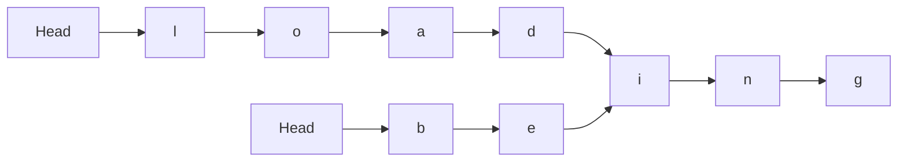

**例：**  
假定采用带头节点的单链表保存单词，当两单词有相同的后缀时，则可共享相同的后缀存储空间，例如，“loading”和“being”的存储映像如下图所示：

设str1和str2分别指向两个单词所在单链表的头节点，链表节点结构为

<table>
  <tr><td>data</td><td>next</td></tr>
</table>

请设计一个***时间上尽可能高效***的算法， 找出由str1和str2所指向两个链表共同后缀的起始位置(如图中i字符所在结点的位置p)  
[代码](exercises/查找两个单链表的第一个公共节点.c)

***  

**解析：**  
***算法：*** 快慢指针  
1.分别求出长度m，n  
2.得到差值  
3.快指针先走差值步  
4.当快慢指针相遇时得到p
